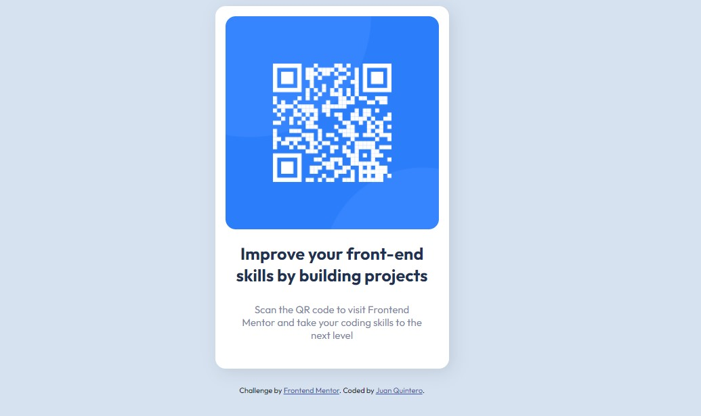

# Frontend Mentor - QR code component solution

This is a solution to the [QR code component challenge on Frontend Mentor](https://www.frontendmentor.io/challenges/qr-code-component-iux_sIO_H). Frontend Mentor challenges help you improve your coding skills by building realistic projects. 

## Table of contents

- [Overview](#overview)
  - [Screenshot](#screenshot)
  - [Links](#links)
- [My process](#my-process)
  - [Built with](#built-with)
  - [Useful resources](#useful-resources)
- [Author](#author)

## Overview

### Screenshot

### Links

- Solution URL: [https://www.frontendmentor.io/challenges/qr-code-component-iux_sIO_H/hub/qr-code-component-eJBdBV0o-/solutions](https://www.frontendmentor.io/challenges/qr-code-component-iux_sIO_H/hub/qr-code-component-eJBdBV0o-/solutions)
- Live Site URL: [https://juanpq26.github.io/qr-code-component/](https://juanpq26.github.io/qr-code-component/)

## My process

### Built with

- Semantic HTML5 markup
- SASS CSS Preprocessor
- Flexbox
- [Vue.js](https://vuejs.org/) - JS library

### Useful resources

- [MDN Web Docs](https://developer.mozilla.org/es/docs/Web/CSS/CSS_Flexible_Box_Layout/Basic_Concepts_of_Flexbox) - This helped me to use Flexbox.
- [Vue.js Docs](https://vuejs.org/v2/guide/) - This helped me to use Vue.js.

## Author

- Frontend Mentor - [@JuanPQ26](https://www.frontendmentor.io/profile/JuanPQ26)
- Twitter - [@juanpq2003](https://www.twitter.com/juanpq2003)
